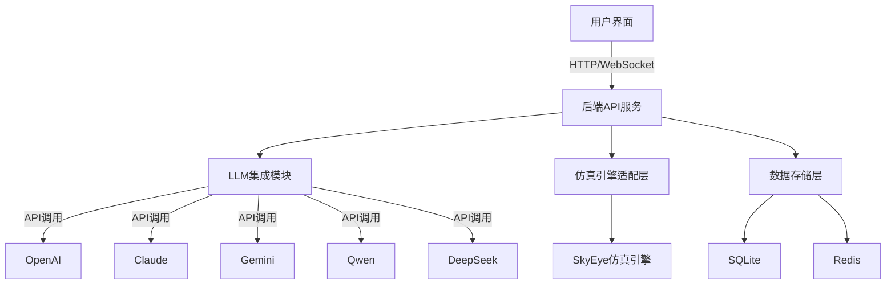

# SimSynAI_ MVP设计方案

## 一、项目概述

SimSynAI_ MVP版本是一个基于大语言模型的智能化仿真平台的最小可行产品，旨在验证核心功能并快速获取用户反馈。平台以SkyEye仿真引擎为基础，通过智能化手段降低仿真软件的使用门槛、提升仿真效率与可理解性。

### MVP核心目标
1. 实现用户与大模型的自然语言交互，完成基础仿真配置与执行
2. 提供简洁的仿真结果可视化与分析能力
3. 集成多种大语言模型（GPT、Claude、Gemini、Qwen、DeepSeek）
4. 支持Docker一键部署，便于快速安装与使用

## 二、技术栈选择

| 层级 | 技术选型 | 说明 |
|------|----------|------|
| 前端 | React + TypeScript + Ant Design | 成熟稳定的UI框架，快速构建企业级界面 |
| 数据可视化 | ECharts (基础图表) | 轻量级但功能强大的图表库 |
| 实时通信 | Socket.io | 简单易用的WebSocket封装 |
| 后端 | FastAPI + Pydantic | 高性能异步API框架，自带文档 |
| LLM集成 | LangChain + LangGraph (简化版) | 灵活的大模型调用与编排 |
| 模型支持 | OpenAI API、Anthropic API、Google API、阿里云API、DeepSeek API | 多模型支持 |
| 数据库 | SQLite + Redis | 轻量级数据存储与缓存 |
| 仿真适配层 | Python包装器 | SkyEye仿真引擎的简化接口 |
| 部署 | Docker Compose | 一键部署整个系统 |
| 文档 | Swagger UI + Markdown | 自动生成API文档 |

## 三、MVP核心功能模块

### 1. 用户界面（简化版）
- 登录/注册页面（基础认证）
- 仿真任务管理页面
- AI对话界面（支持多种模型切换）
- 基础数据可视化页面（图表展示）
- 简易仪表盘

### 2. 大语言模型集成
- 模型接入适配器（支持5种指定模型）
- 统一的API调用接口
- 基础Prompt模板管理
- 对话历史存储与上下文管理

### 3. 仿真引擎适配层
- SkyEye基础API封装
- 仿真任务创建与执行
- 参数配置与验证
- 结果数据收集与格式化

### 4. 基础智能助手
- 仿真配置助手（帮助用户配置参数）
- 结果分析助手（解释仿真结果）
- 错误诊断助手（分析仿真错误）

### 5. 数据管理
- 用户信息管理
- 仿真任务存储
- 对话历史保存
- 仿真结果缓存

### 6. 部署与运维
- Docker容器化配置
- 一键部署脚本
- 基础日志收集
- 简易监控

## 四、系统架构（简化版）



## 五、开发计划

### 阶段一：基础框架搭建（2周）
1. 项目初始化与代码库建立
2. 前端基础框架搭建
3. 后端API服务框架搭建
4. 数据库设计与初始化
5. Docker环境配置

### 阶段二：核心功能开发（4周）
1. 用户认证系统实现
2. LLM集成模块开发
3. 仿真引擎适配层开发
4. 基础对话功能实现
5. 简易仿真任务管理

### 阶段三：功能完善与集成（2周）
1. 数据可视化模块实现
2. 智能助手功能开发
3. 系统集成与测试
4. 文档编写
5. 部署脚本优化

### 阶段四：测试与发布（2周）
1. 系统测试与bug修复
2. 性能优化
3. 用户体验改进
4. 部署文档完善
5. MVP版本发布

## 六、目录结构

```
neurosimlab/
├── frontend/                # React前端
│   ├── public/
│   │   ├── components/      # UI组件
│   │   ├── pages/           # 页面
│   │   ├── services/        # API服务
│   │   └── utils/           # 工具函数
│   └── package.json
├── backend/                 # FastAPI后端
│   ├── app/
│   │   ├── api/             # API路由
│   │   ├── core/            # 核心配置
│   │   ├── db/              # 数据库模型
│   │   ├── llm/             # LLM集成
│   │   └── simulation/      # 仿真引擎适配
│   ├── main.py              # 入口文件
│   └── requirements.txt
├── docker/                  # Docker配置
│   ├── docker-compose.yml
│   ├── frontend.Dockerfile
│   └── backend.Dockerfile
└── README.md                # 项目说明
```

## 七、接口设计（核心API）

### 用户认证API
- `POST /api/auth/register` - 用户注册
- `POST /api/auth/login` - 用户登录
- `GET /api/auth/me` - 获取当前用户信息

### LLM对话API
- `POST /api/chat/message` - 发送对话消息
- `GET /api/chat/history` - 获取对话历史
- `POST /api/chat/model` - 切换对话模型

### 仿真任务API
- `POST /api/simulation/task` - 创建仿真任务
- `GET /api/simulation/task/{id}` - 获取任务详情
- `GET /api/simulation/tasks` - 获取任务列表
- `POST /api/simulation/task/{id}/execute` - 执行仿真任务

### 数据可视化API
- `GET /api/visualization/data/{task_id}` - 获取可视化数据
- `GET /api/visualization/templates` - 获取可视化模板

## 八、部署要求

### 最低硬件要求
- CPU: 4核
- 内存: 8GB
- 存储: 20GB

### 软件要求
- Docker Engine 20.10+
- Docker Compose 2.0+
- 现代浏览器（Chrome, Firefox, Edge等）

### 网络要求
- 互联网连接（用于API调用）
- 开放端口：80/443（Web服务）

## 九、后续迭代计划

MVP发布后，根据用户反馈，计划在以下方向进行迭代：

1. 增强数据可视化能力
2. 完善多智能体系统
3. 添加更多仿真引擎支持
4. 优化用户界面与体验
5. 增加团队协作功能
6. 实现知识库系统
7. 增强报告生成能力

## 十、风险评估与对策

| 风险 | 可能性 | 影响 | 对策 |
|------|--------|------|------|
| LLM API稳定性 | 中 | 高 | 实现模型降级和重试机制 |
| 仿真引擎集成难度 | 高 | 高 | 先实现核心功能，逐步扩展 |
| 用户体验不佳 | 中 | 中 | 早期获取用户反馈，快速迭代 |
| 系统性能问题 | 低 | 中 | 实现基础监控，及时优化 |
| 开发周期延长 | 中 | 中 | 严格控制MVP范围，避免功能蔓延 | 